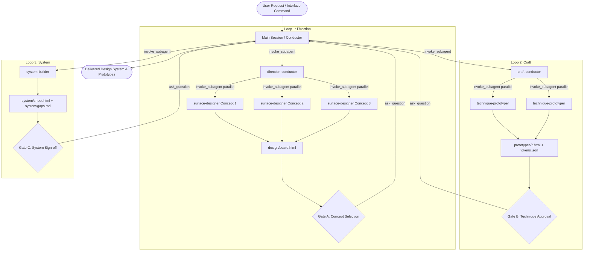

# `inter.face` Antigravity Plugin Installation & Verification Report

**Repository**: [PIIIX-org/inter.face](https://github.com/PIIIX-org/inter.face)  
**Dedicated Branch**: `gemini-antigravity`  
**Installation Mode**: Global Antigravity Plugin + Always-On Multi-Agent Protocol  
**Status**: **Verified & Active**

---

## 1. Executive Summary

The Antigravity edition of the `inter.face` interface art direction and design system engine has been installed from the official `gemini-antigravity` branch.

The plugin equips Google Antigravity with:
1. **Isolated Subagent Pipeline**: 6 specialized agents configured for multi-agent dispatch via `define_subagent` and `invoke_subagent`.
2. **Slash Command & Skill**: `/interface` command and `inter.face` skill accessible across sessions.
3. **Always-On Protocol Rules**: Registered in `~/.agents/rules/inter.face.md` and `~/.gemini/config/rules/inter.face.md`, enforcing the 3 hard gates and accessibility defaults across all new and existing sessions.
4. **Automated Verification Harness**: Unit verification scripts for Loops 1, 2, and 3 (`teamwork/verification/`).

---

## 2. Architecture & Components



---

## 3. Registered Agents & Subagent Roster

| Agent Name | Role | Responsibilities | Tools |
| :--- | :--- | :--- | :--- |
| `direction-conductor` | Direction Conductor | Derives 3 distinct design concepts, settles palette/type, checks ACCESS.md §13, dispatches workers, generates `design/board.html`. | Write, Subagents, MCP |
| `surface-designer` | Surface Designer | Produces ONE comp of ONE surface for ONE concept (coded spec block or image mode). | Write, MCP |
| `craft-conductor` | Craft Conductor | Assigns techniques against the 3-question test, dispatches prototypers, drafts motion specs and token groups. | Write, Subagents, MCP |
| `technique-prototyper`| Technique Prototyper | Builds standalone runnable HTML prototype, tests 60fps load and byte budget. | Write |
| `system-builder` | System Builder | Builds navigable component sheet (`system/sheet.html`) purely from tokens, audits keyboard navigation (§15). | Write |
| `redesign-scout` | Redesign Scout | Audits existing interfaces, creates `CURRENT.md`, runs absence sweep, generates fork recommendations. | Write, MCP |

---

## 4. File Locations & Installation Manifest

| Component | Path | Status |
| :--- | :--- | :--- |
| **Active Global Plugin** | `C:\Users\successbyte\.gemini\config\plugins\inter-face` | Installed (`agy plugin install`) |
| **Plugin Git Repository** | `C:\Users\successbyte\.agents\plugins\inter.face` (`gemini-antigravity` branch) | Cloned & Validated |
| **Universal Skill** | `C:\Users\successbyte\.agents\skills\inter.face\SKILL.md` | Active in `<skills>` prompt |
| **Local Rule (Project)** | `C:\Users\successbyte\.agents\rules\inter.face.md` | Created & Active |
| **Global Rule (Sessions)**| `C:\Users\successbyte\.gemini\config\rules\inter.face.md` | Installed & Active |
| **Plugins Declarations** | `~/.agents/plugins.json` & `~/.gemini/config/plugins.json` | Configured |
| **Subagents Loader** | `antigravity/bootstrap.js` | Verified (`node antigravity/bootstrap.js`) |
| **Verification Suite** | `teamwork/verification/verify-all.js` | Verified functional |

---

## 5. Verification Highlights

1. **`agy plugin list`**:
   ```json
   {
     "imports": [
       {
         "name": "inter-face",
         "source": "antigravity",
         "importedAt": "2026-09-21T05:34:04Z",
         "components": ["skills", "agents", "commands"]
       }
     ]
   }
   ```
2. **`agy plugin validate`**:
   - `✔ skills`: 1 processed
   - `✔ agents`: 6 processed
   - `✔ commands`: 1 processed (converted to skills)
   - Status: All components validated.
3. **Subagent Extraction**:
   - Verified that `node antigravity/bootstrap.js` parses all 6 agent manifests cleanly for `define_subagent`.

---

## 6. Three Non-Negotiable Hard Rules

1. **§10 Accessible by Default**:
   - Palette contrast verified against WCAG AA before drafting comps.
   - Reduced-motion state designed for every animation.
2. **§15 Keyboard Completeness**:
   - Strictly enforced on tool-shaped surfaces.
   - Every workflow walkable by keyboard alone.
3. **§16 Human Gates are Real Stops**:
   - Conductors pause and present artifacts at Gate A, Gate B, and Gate C.
   - Never bypass or auto-certify past a gate without explicit human response via `ask_question`.
